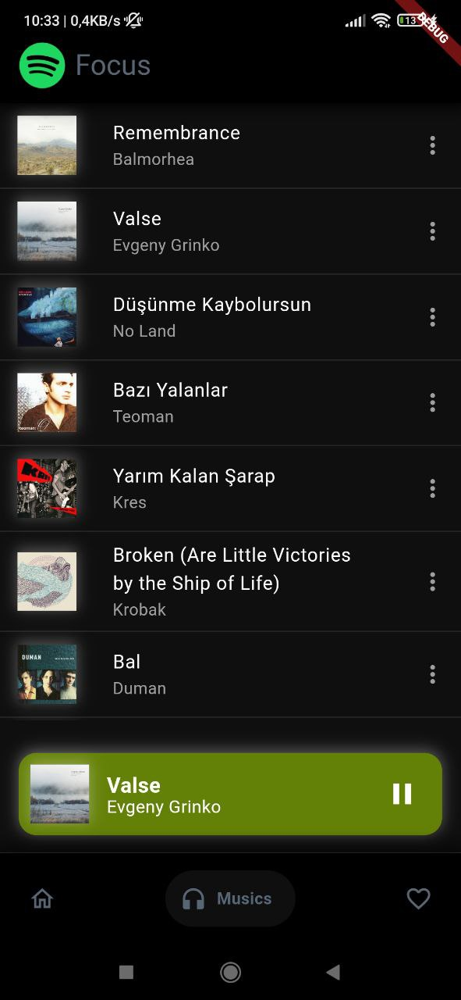
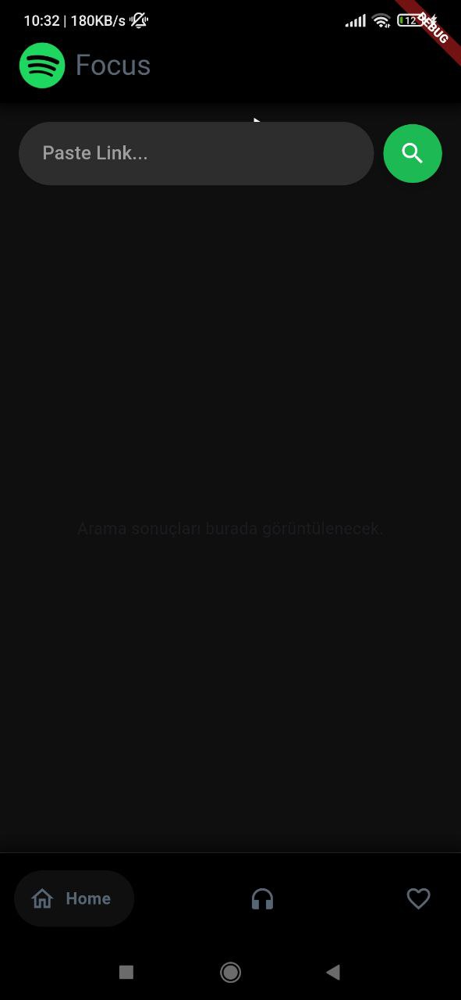

# Spotify Playlist Downloader 🎧

A sleek and modern **Flutter** application that allows users to easily download songs from a Spotify playlist by simply pasting the playlist URL. This app is built entirely with **Flutter** and communicates with a backend API to fetch and download the songs effortlessly.

## ✨ Features

- 🎵 **Paste any Spotify playlist URL**  
- ⬇️ **Download all songs** in a playlist with one click  
- ⚡️ **Fast and intuitive user interface**  
- 📱 **100% built with Flutter**  
- 🌐 Communicates with an **external API** for song data  

---

<p align="center"> ## 🖥️ Screenshots</p>
<p align="center">
  
  
</p>
---

## 🚀 Getting Started

To get started with the app, follow the instructions below to clone the repository and run it locally:

### 1. **Clone the repository**

```bash
git clone https://github.com/foxyscat/spotify-downloader.git
cd spotify-downloader
flutter pub get
flutter run
